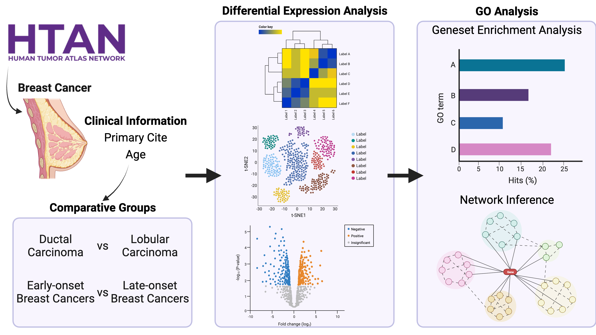

# Differential-Gene-Expression

The goal of this project is to identify differentially expressed genes in breast cancer using single-cell RNA sequencing data or bulk RNA sequencing data.

### Script organization:

`0_download_data.ipynb`: Jupiter notebook that helps pull data from Synapse and upload onto the Cancer Genomics Cloud.

## Tools being used

* DESeq2 for differential gene expression analysis [correct?]
* GENIE3 for network inference

### References

Huynh-Thu et al, PLoS One 2010: "Inferring regulatory networks from expression data using tree-based methods"
