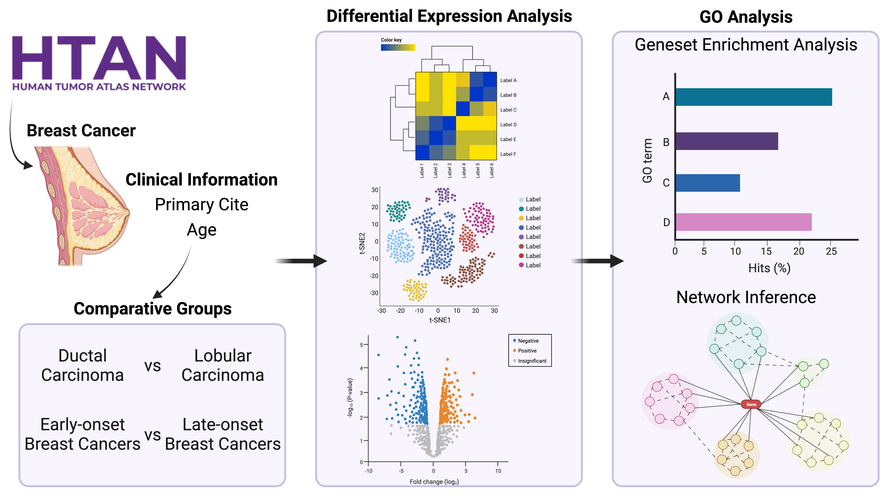

# Breast Cancer Gene Expression Analysis (HTAN Data Jamboree, Dec 4-7, 2023)

## Introduction

Breast cancer is the leading cause of cancer-related death in women worldwide. Breast cancer is highly heterogeneous at both the molecular and clinical levels. Based on the expression of the estrogen receptor (ER), progesterone receptor (PR), and overexpression of HER2 or amplification of the HER2 gene ERBB2, breast cancers are divided into Luminal (ER+, PR+/−), HER2+ (HER2+, ER+/−, PR+/−) and triple-negative (TNBC; ER−, PR−, HER2−). Based on the origin of the disease, breast cancers are usually defined as ductal or lobular carcinoma. 
The tumor microenvironment (TME) in breast cancer is essential in tumor progression and drug response. TME comprises local factors, cancer cells, immune cells, and stromal cells of the local and distant tissues. The interaction between cancer cells and their microenvironment plays essential roles in tumor proliferation, propagation, and response to therapies. A recent study provides a comprehensive transcriptional atlas of the TME of breast cancer based on their molecular subtypes. However, only a few studies have been done to identify the heterogenous TME in the ductal and lobular carcinomas. 
Using scRNA seq data from HTAN, this study will provide a comprehensive transcriptional atlas of the cellular architecture of breast TME.


## Goals and Objectives
The goal of this project is to identify differentially expressed genes in breast cancer using single-cell RNA sequencing data or bulk RNA sequencing data.  
- To process and analyze RNA sequencing data for breast cancer.
- Identify key differentially expressed genes associated with breast cancer.



## Technologies and Frameworks Used
- Python 3.11
- Data proecessing & ifferential gene expression analysis tools (Scanpy)
- Network inference analysis tools (GENIE3)
- Data visualization libraries (Matplotlib, Seaborn)

## Installation and Setup
1. Clone the repository:
   ```
   git clone https://github.com/NCI-HTAN-Jamborees/Differential-Gene-Expression.git
   ```

## Usage
`0_download_data.ipynb`: Jupiter notebook that helps pull data from Synapse and upload onto the Cancer Genomics Cloud.

`convert_gene_name_to_ensemble.ipynb`: Utility Jupiter notebook which reads differentially expressed gene list (csv format) and translates to Ensemble ID

## Data
This project uses scRNA sequencing data (level 3&4) from [HTAN](https://humantumoratlas.org/). The two datasets of interest are HTAN HTAPP and HTAP WUSTL.  
Different contrast groups were utilized for the different datasets, namely age and diagnosis for HTAPP and race and disease progression/recurrence for WUSTL.

## Results and Analysis
The analysis outputs a list of differentially expressed genes, which can be found in 

## License
This project is licensed under the [MIT](https://github.com/NCI-HTAN-Jamborees/Differential-Gene-Expression/blob/main/LICENSE).

## References

Huynh-Thu et al, PLoS One 2010: "Inferring regulatory networks from expression data using tree-based methods"

## Team Members


- **Team Lead**: Rebecca Sansale
- **Data Analysts**:
  - Giovanni Dall’Olio
  - Shivani Guturu
  - Minji Kim (also Illustrator)
  - Jiaying Lai
- **Tech Lead & Analyst**: Nirvana Nursimulu
- **Writer & Advisor**: Tapasree Roy Sarkar
